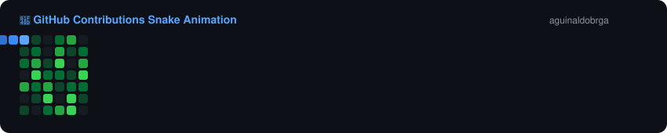

<div align="center">
  
  <!-- Banner / Header Image -->
  

  <!-- Typing SVG Effect -->
  <a href="https://github.com/aguinaldobrga">
    
  </a>

  <!-- Profile Views Badge -->
  <p align="center">
    
  </p>

  <!-- Social Badges -->
  <p align="center">
    <a href="https://www.linkedin.com/in/SEU_LINKEDIN" target="_blank">
      
    </a>
    <a href="mailto:guigo.abf@gmail.com" target="_blank">
      
    </a>
    <a href="https://instagram.com/SEU_INSTAGRAM" target="_blank">
      
    </a>
  </p>

</div>

<br/>

### 👨‍💻 Sobre Mim

```javascript
const aguinaldo = {
    pronouns: "ele/dele",
    code: ["JavaScript", "TypeScript", "Python", "HTML", "CSS", "SQL"],
    tools: ["Git", "GitHub", "VS Code", "Docker"],
    currentFocus: "Aprimorando habilidades em desenvolvimento web & novas tecnologias 🚀",
    funFact: "Amo resolver problemas complexos com soluções simples e elegantes 💡"
};
```

- 🔭 Atualmente trabalhando em **projetos inovadores**
- 🌱 Constantemente aprendendo e explorando **novas stacks e arquiteturas**
- 💬 Me pergunte sobre **Desenvolvimento Web, APIs, Banco de Dados, etc.**
- ⚡ Curiosidade: **Sempre pronto para um bom café e uma boa conversa sobre tecnologia! ☕**

---

### 🛠️ Tecnologias & Ferramentas

<div align="center">

  <!-- Linguagens -->
  
  
  
  
  

  <br/>

  <!-- Frameworks & Bibliotecas -->
  
  
  

  <br/>

  <!-- Ferramentas & Bancos de Dados -->
  
  
  
  
  

</div>

---

### 📊 Estatísticas do GitHub

<div align="center">
  <table border="0">
    <tr>
      <td>
        
      </td>
      <td>
        
      </td>
    </tr>
  </table>

  <!-- Streak Stats -->
  <p align="center">
    
  </p>

  <!-- Activity Graph -->
  <p align="center">
    
  </p>
</div>

---

### 🐍 Snake Game (Contribuições)

<div align="center">
  
</div>

---

<div align="center">
  <!-- Footer Banner -->
  
</div>
